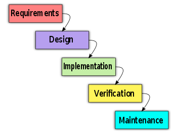
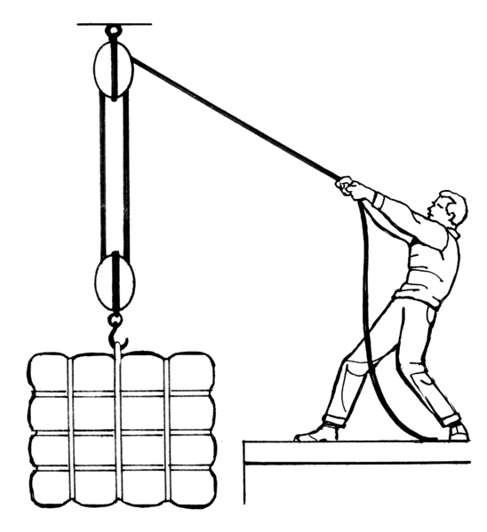
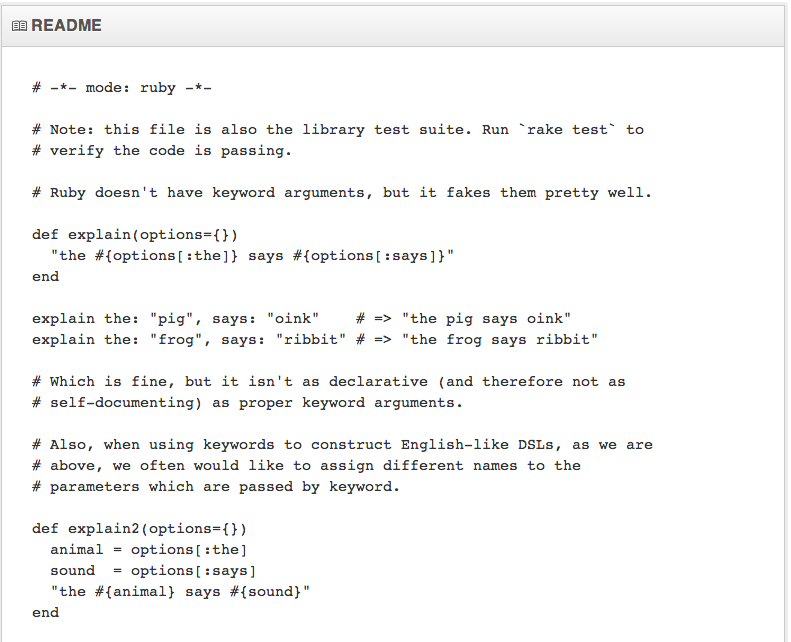

This is a story of how I wrote a gem.

Ok, that's not very exciting.

This is the story about how I wrote a gem without knowing the
implementation, the API or even what clever name I would give it.

In other words, how I write nearly everything.

But this time I tried to do it better.

The gem I wrote is unimportant. The problem I faced when writing it is
more universal. 

Remembering an idea I heard on Ruby Rogues (epsiode #44), I decided to
try Readme Driven Development. 

Before I wrote any code, I would write the Readme. 

Then I would implement tests that assert the Readme is
correct. 

Then I would write code that passes the tests.

## Why?

"Writing a Readme is absolutely essential to writing good software. Until you've written about your software, you have no idea what you'll be coding."  
- Tom Preston-Werner
<aside class='notes'>This is from a 2010 blog post on RDD. I didn't recognize this name initially, but if
anyone has made the Readme important, it's Tom, co-founder of GitHub.
What's the first thing you see for every project on GitHub? The readme. What's the one file GitHub nags you to create for any new repo? The readme.</aside>

Ok, I'm writing 'about my software'. But about what, exactly?
<aside class='notes'>'The Gem' is the obvious answer, but maybe a little
abstract. I think the readme should have 4 sections</aside>

### The readme should:
  - Explain what the gem does
  - Installation & Configuration
  - Examples of use
  - General API documentation

So, I have a documentation of my gem before I write any
code? Wait, this sounds familiar&hellip;

## BDUF

We've heaped so much scorn on BDUF that we've forgotten what was
terrible about it and what actually had some value:

### The Terrible:
  - Wrangling with Product Managers and Stakeholders through endless
    meetings
  - The huge hassle of changing a spec that had been approved

### The Value:
  - The optimism of a clean design, unsullied by actual code
  - The greater understanding of a problem that can come from writing in
    natural language
  - Spotting API or implementation problems before you have a bunch of
    libraries that do it wrong.

Ditch the terrible, keep the good. 
<aside class='notes'>That's glib. Just realize that by writing a Readme
first you aren't binding yourself irrevocably to it. It's a place
for you to describe what you need the gem to do. It's not something that
needs a ton of bulky processess around it.</aside>

### First Rule
#### Describe a gem that would make you happy to use.
<aside class='notes'>If it's going to make you happy, then it's more
likely to make others happy. Don't worry about implementation (much),
just make it pleasing.</aside>

This is where I started. I already had the beginning of a design, but it didn't make me happy:

  - Fiddly
  - Required a lot of objects serialzed into hashes
  - Followed implementation patterns I was very familiar with, even though those weren't entirely appropriate.

I ditched that and wrote a Readme I found pleasing:

  - Easy to configure
  - No huge hashes
  - Metaprogramming the behavior I wanted into an object
  - Simple form helpers for easy display, keeping Rails helpers if I need more complex behavior.

Great! Now if I only knew how to make that happen.

The unfettered freedom of natural language gives you more than enough rope to hang yourself.

### Second Rule
#### Prevent accidental hangings

  * YAGNI
  * Small
  * Stay within the possible, not the known
<aside class='notes'>YAGNI is a vital rule, no matter what you're
writing. But when you're writing this free-form natural document, you
have to keep a closer eye on it. It's really easy for extra, unnecessary
functionality to get in there. Keep both your gem and readme small.
Small gems are more re-usable. Small readmes reflect that focus, and
come from having a tight, useable API. As for that 3rd point, that leads
to a corollary of the 2nd rule.</aside>

### Hoisting > Hanging

  * Improve yourself
  * Improve your gem
<aside class='notes'>Describing a feature you want, but don't quite now
how to implement lets you learn a new technique. Starting with code, or
even tests first can lead you towards familiar implementations and
stagnation.</aside>

My inital README was wrong in a lot of ways. That's fine. The syntax
doesn't need to be perfect. It's a guide, not a railroad track.

Just don't forget to update your readme as you go.

### Third Rule
#### Writing is Rewriting

  1. Document feature
  2. Test feature
  3. Implement feature
  4. Refactor
  5. Goto 1 and revise

Works great even for features you're not sure you want
<aside class='notes'>My inital intent was to do all configuration through yaml. Co-worker
suggested also doing class-level macros. I wasn't in love with it, but I went along with it and 
documented the feature in the readme. After documenting it, I realized the data structure was
exactly the same, so implementing both would be a snap and might make
the gem more useful. That's a win.</aside>

## Getting really jiggy with it
https://github.com/avdi/keyword_params

### When to use it:
  - Small gems
  - Greenfield work

### Less Good Situations:
  - Monolithic applications
  - A replacement for existing API

### The accolades:
    The README is top notch.  Really.  
    - James Edward Gray II

## Thanks
  - The GitHub: IanWhitney
  - The Blog: IanWhitney.github.io
  - The Twitter: iwhitney
  - The Gem: hstore_radio_buttons
